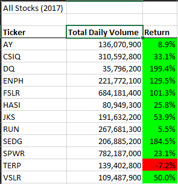
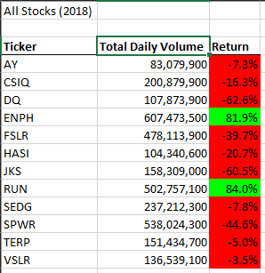

# VBA of Wall Street

## Overview

### Purpose

## Results

When run without the refactored code, it took 0.78125 seconds to complete the calculations for each year.  
When ran with the refactored code, it took0.117875 seconds to complete the calculations.

## Summary

The advantage of refactoring code is that the result can be exponentially quicker and possibly the code being more cleaner. In the VBA Script, assuming the ratio between the refactored code and no refactored code is the same, a larger set of stocks that would normally take 5 minutes on this pc would only take 45 seconds using the refactored code. A disadvantage of refactoring code si that it would take much longer to rewrite the code in order to make it more effecient. writing 2 for loops in the VBA script was fairly simple and easy to do, but editing and changing it so only one loop is required and required a bit more planning. When hiring someone to code, refactoring can greatly increase the cost of the coding, so the effeciency of the end result would have to be a significant enough change for refactoring to be worth it.
